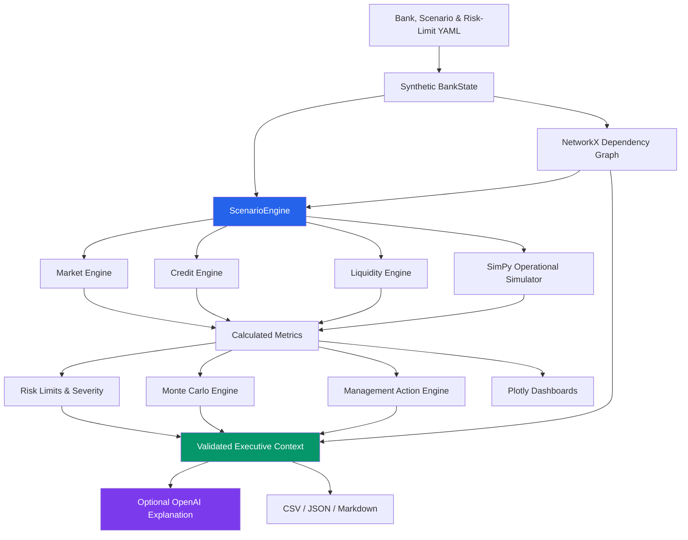

# AI-Financial-Digital-Twin

An end-to-end, auditable prototype for simulating how financial, operational, technology, and customer risks propagate through a synthetic USD 100 billion bank.

The project creates a virtual banking environment where you can inject stress events, trace their impact through interconnected systems, quantify financial and operational consequences, test management responses, and optionally use an LLM to translate validated Python simulation results into an executive narrative.

> [!IMPORTANT]
> Synthetic prototype only. All institutions, customers, counterparties, exposures, scenarios, metrics, and results are synthetic. This project is not a regulatory stress-testing model, financial advice, an approved bank risk model, or a substitute for independent model validation.

## Why this project?

A cloud outage is rarely just a technology problem. Consider this chain:

    Cloud Region Failure
            ↓
    Application Disruption
            ↓
    Payment Service Degradation
            ↓
    Payment Backlog
            ↓
    Customer Impact
            ↓
    Deposit Withdrawals
            ↓
    Liquidity Consumption
            ↓
    LCR / Risk-Limit Impact

Traditional risk models often analyze these domains separately. This prototype explores a different question:
> Can a Digital Twin connect technology, operations, customers, liquidity, market risk, credit risk, and capital into one explainable simulation? 
The project creates a synthetic bank that can be deliberately stressed without using real customer or institutional data.


## What the project demonstrates

The Digital Twin combines:

* A reproducible synthetic USD 100 billion bank.
* Balance-sheet, customer, counterparty, application, infrastructure, cloud, and payment-system data.
* YAML-driven deterministic stress scenarios.
* NetworkX dependency graphs and causal propagation paths.
* SimPy hour-by-hour outage, failover, capacity, payment backlog, and recovery simulation.
* Market, credit, liquidity, capital, customer, and operational impact calculations.
* Risk-limit monitoring with warning and critical classifications.
* Monte Carlo simulation for ranges and breach frequencies.
* Management-action evaluation through complete scenario reruns.
* Plotly operational, risk, dependency, and executive dashboards.
* Optional OpenAI-based interpretation over compact, validated Python results.
* Reproducible CSV, JSON, and Markdown outputs.
* Automated tests covering the major calculation and simulation paths.

## Architecture



The notebook orchestrates the existing engines; it does not contain an independent calculation model.


## Core modules

| Module | Responsibility |
|---|---|
| `data_generator.py` | Creates reproducible synthetic bank datasets and dependencies. |
| `bank_state.py` | Stores bank data and scenario-result objects. |
| `config.py` | Loads baseline, risk-limit, and scenario YAML files. |
| `dependency_graph.py` | Builds the NetworkX graph, blast radius, and propagation paths. |
| `scenario_engine.py` | Coordinates each complete scenario run. |
| `market_engine.py` | Calculates FX revaluation and volatility loss. |
| `credit_engine.py` | Calculates expected-loss changes and counterparty-default loss. |
| `liquidity_engine.py` | Calculates deposit outflows, cash, HQLA, funding, and prototype LCR. |
| `operational_simulator.py` | Simulates payment arrivals, processing capacity, backlog, failover, and recovery. |
| `metrics.py` | Creates KPIs, evaluates risk limits, and classifies management severity. |
| `monte_carlo.py` | Samples uncertain combined-stress inputs and reports distributions. |
| `action_engine.py` | Reruns scenarios with single and combined management actions. |
| `visualizations.py` | Produces Plotly graphs and dashboards. |
| `ai_explainer.py` | Builds compact validated LLM payloads and optional explanations. |

## Dependency graph and risk propagation 

A bank is not just a balance sheet. It is a network of infrastructure, applications, services, customers, counterparties, and financial-risk relationships. The project represents those relationships using NetworkX.DiGraph.

Synthetic dependencies are defined in: src/digital_twin/data_generator.py

They can be extended to represent additional assets, services, infrastructure, customers, or dependencies for other use cases.


For a failed node, the graph engine identifies reachable downstream nodes and groups the resulting blast radius by node type.

The graph is also used to identify:

* critical nodes;
* high betweenness-centrality nodes;
* single points of failure;
* cloud concentration risk;
* affected applications;
* affected business services;
* affected customer segments;
* financial and risk nodes;
* material propagation paths.

Edge weights can participate in modeled customer-behaviour propagation.

> [!NOTE]
The LLM does not create graph dependencies. Propagation paths supplied to the LLM come from the Python Digital Twin.

## Scenario library

Scenario files are stored in `configs/scenarios`.

| Scenario ID | Purpose |
|---|---|
| `usd_fall` | Revalues the bank's unhedged USD exposure. |
| `deposit_run` | Applies segment-level deposit-withdrawal stress. |
| `payment_outage` | Tests a payment-processing outage. |
| `volatility_shock` | Applies a market-volatility multiplier. |
| `cloud_failure` | Generic cloud-failure scenario. |
| `counterparty_default` | Defaults a named synthetic counterparty. |
| `cloud_region_a_8hr` | Dedicated infrastructure-only eight-hour cloud resilience scenario. |
| `combined_stress` | Flagship simultaneous market, credit, liquidity, customer, and operational stress. |

Scenarios can be modified directly through their YAML configuration files. New scenarios can also be added without rebuilding the core simulation architecture.

## Three level of stress testing 

The master notebook demonstrates three complementary ways of using the Digital Twin.

 A. Individual Scenario > Understand isolated shocks

 B. Cloud Resilience Scenario > Understand detailed operational propagation

 C. Combined Stress > Understand simultaneous cross-risk stress

You can configure the scenarios by directly updating the respective yaml files. You can also add new scenarios. 

### (A) Individual Scenario Runs

The first experiment runs six shocks independently:

    usd_fall
    deposit_run
    payment_outage
    volatility_shock
    cloud_failure
    counterparty_default

Each scenario starts from the same synthetic baseline. This makes it easier to understand the isolated effect of each shock before combining them.

Input: Individual scenario YAML definitions.

Primary outputs: individual_results ; scenario_table

The resulting comparison highlights how different shocks affect financial and operational KPIs.


### (B) Cloud Region A - 8 Hour Failure 

This is the project’s dedicated operational-resilience experiment. Imagine the bank’s primary cloud region suddenly becomes unavailable.

The configured scenario is:

```text
Hour 0:     Cloud Region A fails
Hour 0–3:   Region B is unavailable
Hour 3:     Region B activates
Hour 3–8:   Region B operates at 70% capacity
Hour 8:     Region A recovers
After 8:    125% temporary capacity clears the backlog
```

The YAML defines the infrastructure shock.

It does not manually specify every downstream business consequence. Instead:

1. NetworkX identifies affected downstream dependencies.
2. Application deployment data determines backup availability.
3. SimPy models processing capacity and payment queues over time.
4. Customer and financial models calculate downstream effects.
5. The ScenarioEngine consolidates the resulting KPIs and risk-limit impacts.

This separation is central to the Digital Twin architecture.

Applications contain deployment attributes such as:

    Primary Region
    Backup Region
    Backup Mode
    Failover Time
    Normal Capacity
    Backup Capacity
    Criticality

The Digital Twin can therefore distinguish between applications that:

* are directly hosted in the failed region;
* have a designated backup;
* successfully fail over;
* operate with reduced capacity;
* have no usable backup.


NetworkX traces the validated downstream paths created by the infrastructure failure. The blast radius is analyzed across:

    Infrastructure
          ↓
    Applications
          ↓
    Business Services
          ↓
    Customer Segments
          ↓
    Financial / Risk Nodes


Restoring an application does not necessarily mean the business has fully recovered. Payments can continue accumulating while processing capacity is impaired.The simulator therefore distinguishes:

    Infrastructure Recovery
              ↓
    Processing Capacity Restored
              ↓
    Existing Payment Backlog
              ↓
    Queue Clearance
              ↓
    Full Operational Recovery

This allows the prototype to model both service restoration and backlog clearance.


The above scenario can be rerun with parameter overrides. For example 

    cloud_1hr_backup = engine.run(
        'cloud_region_a_8hr',
        overrides={
            'operational': {
                'backup_activation_delay_hours': 1
            }
        }
    )
This allows a controlled comparison between the original three-hour activation and a hypothetical one-hour activation.

The Digital Twin compares impacts such as:

* payment backlog;
* customers affected;
* deposit outflow;
* operational loss;
* liquidity consumed;
* LCR;
* total recovery time.

This demonstrates the core value of a Digital Twin:
> Don’t only ask what failed. Ask what would change if the system were designed differently.

### (C) Flagship combined stress

The flagship scenario simultaneously applies:

- a 10% USD shock;
- a 2.0 volatility multiplier;
- Retail, SME, Corporate, and Private Banking withdrawals;
- default of synthetic counterparty `CP-006`;
- a credit PD multiplier;
- a cloud/payment impairment with its own timing and capacity assumptions.


#### Monte Carlo simulation

The notebook runs 1,000 stochastic variations of `combined_stress` using seed 42. It samples:

- USD shock;
- volatility multiplier;
- Retail, SME, and Corporate withdrawal rates;
- operational recovery duration;
- counterparty default-loss multiplier.

It reports P5, median, P95, and separate breach probabilities for LCR, cash, CET1, payment availability, loss, and recovery time.

The current Monte Carlo is designed for combined stress only. 


#### Management actions

For the combined stress analysis, the code also recommends follow up management action.

Supported actions:

| Action | Primary risk domain |
|---|---|
| Activate Backup Region | Operational resilience |
| Prioritise Critical Payments | Operational resilience |
| Sell Liquid Securities | Liquidity management |
| Draw Liquidity Facility | Liquidity risk |
| Increase FX Hedge | Market risk |
| Contact High-Risk Corporate Depositors | Liquidity/customer behaviour |

Every action modifies explicit Python simulation parameters and triggers a complete scenario rerun.

The decision lab compares:

```text
No Action
vs
Balanced Single-Action Choice
vs
Combined Response
```

It also reports the best action separately for loss, LCR, cash, operational resilience, customer impact, and balanced resilience. It does not claim a universal best action.


## OpenAI integration

OpenAI is optional. 

The integration sends a compact validated executive context containing calculated metrics, breaches, propagation paths, Monte Carlo summaries, management actions, thresholds, severity transitions, and residual risks. Raw operational time series and unnecessary simulation records are excluded.

The LLM may explain supplied results. It must not:

- calculate financial impacts;
- modify severity classifications;
- invent graph dependencies;
- change scenario assumptions or thresholds;
- claim regulatory validity or economic ROI.

Without a key, the project returns a deterministic Python summary.

## Outputs

The notebook writes generated artifacts to `data/outputs`, including scenario comparisons, Monte Carlo results, propagation traces, executive summaries, and management-action comparisons.

Generated outputs are reproducible when the same code, YAML, and seed are used.

## Master notebook guide

The main entry point is `notebooks/master_runner.ipynb`.

### Local environment

```bash
python3 -m venv .venv
source .venv/bin/activate
python -m pip install --upgrade pip
python -m pip install -r requirements.txt
python -m pip install -e .
pytest -q
jupyter notebook notebooks/master_runner.ipynb
```

### Google Colab

1. Copy the repository folder to Google Drive.
2. Open `notebooks/master_runner.ipynb` in Colab.
3. Change `PROJECT_ROOT` only if your Drive path differs.
4. Store `OPENAI_API_KEY` as a Colab secret if AI narration is required.
5. Choose **Runtime → Run all**.

The notebook installs missing dependencies and writes outputs back into the repository folder.

### Testing


At the time this guide was generated, the suite contained 36 passing tests.
Key Tests cover:

- scenario loading and deterministic execution;
- market, liquidity, credit, and KPI calculations;
- dependency propagation and visualization state;
- cloud deployment, failover, no-backup applications, and timeline;
- LCR numerator and denominator reconciliation;
- Monte Carlo breach probabilities and operational-variable propagation;
- management-action attribution and simultaneous reruns;
- percentage suppression across non-positive baselines;
- risk severity, thresholds, severity distribution, and residual risk;
- payment-prioritisation recovery behavior;
- securities-sale HQLA reconciliation;
- executive-context construction and payload compaction.


## Known limitations

- All data is synthetic and deliberately compact.
- The LCR is simplified and non-regulatory.
- Market risk is sensitivity-based rather than full revaluation.
- Credit risk does not contain full migration, contagion, or wrong-way-risk modelling.
- Operational availability is based on configured regional capacity fractions.
- Customer impact is an aggregate approximation, not individual event tracking.
- Monte Carlo distributions are illustrative and not empirically calibrated.
- Management action costs are incomplete, so economic ROI cannot be claimed.
- RWA generally remains unchanged during stress.
- The model has not been independently validated, calibrated, or back-tested against a real bank.

Production use would require governed source data, lineage, access control, scenario approval, calibration, independent validation, monitoring, back-testing, change control, and regulatory interpretation.


