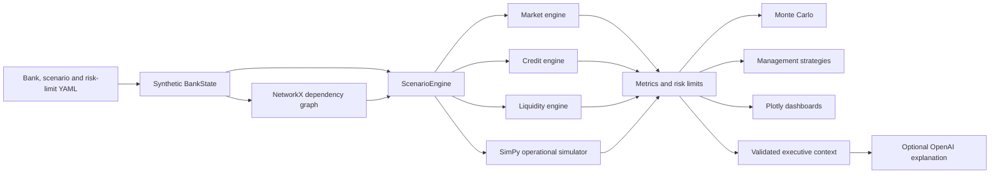

# AI-Financial-Digital-Twin

An end-to-end, auditable prototype of a synthetic USD 100 billion bank. The project demonstrates how technology, operational, market, liquidity, credit, customer-behaviour, and capital risks can propagate through an interconnected banking model.

> [!IMPORTANT]
> All data and results are synthetic. This prototype is not a regulatory stress-testing model, financial advice, an approved bank risk model, or a substitute for independent model validation.

## What the project demonstrates

- A synthetic bank balance sheet, customer base, counterparties, applications, cloud deployments, payment services, and risk limits.
- YAML-driven deterministic scenarios.
- NetworkX dependency and causal-propagation paths.
- SimPy hour-by-hour payment processing, outage, failover, backlog, and recovery.
- Market, credit, liquidity, capital, and operational impact calculations.
- Monte Carlo ranges and per-metric breach probabilities.
- Management actions evaluated through full scenario reruns.
- Plotly operational, risk, and executive dashboards.
- Optional OpenAI explanations over compact, validated Python results.

## Architecture



Python is the numerical source of truth. The notebook orchestrates the existing engines; it does not contain an independent calculation model.


## Core modules

| Module | Responsibility |
|---|---|
| `data_generator.py` | Creates the reproducible synthetic bank datasets. |
| `bank_state.py` | Stores bank data and scenario result objects. |
| `config.py` | Loads baseline, risk-limit, and scenario YAML files. |
| `dependency_graph.py` | Builds the NetworkX graph, blast radius, and propagation paths. |
| `scenario_engine.py` | Coordinates each complete scenario run. |
| `market_engine.py` | Calculates FX revaluation and volatility loss. |
| `credit_engine.py` | Calculates expected-loss changes and counterparty-default loss. |
| `liquidity_engine.py` | Calculates deposit outflows, cash, HQLA, funding, and prototype LCR. |
| `operational_simulator.py` | Simulates payment arrivals, processing capacity, backlog, failover, and recovery. |
| `metrics.py` | Creates KPIs, evaluates risk limits, and classifies management severity. |
| `monte_carlo.py` | Samples uncertain combined-stress inputs and reports distributions. |
| `action_engine.py` | Reruns scenarios with single and combined management actions. |
| `visualizations.py` | Produces Plotly graphs and dashboards. |
| `ai_explainer.py` | Builds compact validated LLM payloads and optional explanations. |

## Dependency graph

The dependency graph is built from the synthetic dependencies ( coded in src/digital_twin/data_generator.py ) using  `Networkx.DiGraph`. You can edit the dependency data to add more assets and dependencies based on your organization use case.


For a failed node, NetworkX identifies reachable downstream nodes and groups the blast radius by node type. Edge weights are also used for modelled customer-behaviour propagation. The LLM never creates dependencies.

## Scenario library

Scenario files are stored in `configs/scenarios`.

| Scenario ID | Purpose |
|---|---|
| `usd_fall` | Revalues the bank's unhedged USD exposure. |
| `deposit_run` | Applies segment-level deposit-withdrawal stress. |
| `payment_outage` | Tests a payment-processing outage. |
| `volatility_shock` | Applies a market-volatility multiplier. |
| `cloud_failure` | Generic cloud-failure scenario. |
| `counterparty_default` | Defaults a named synthetic counterparty. |
| `cloud_region_a_8hr` | Dedicated infrastructure-only eight-hour cloud resilience scenario. |
| `combined_stress` | Flagship simultaneous market, credit, liquidity, customer, and operational stress. |


## Independent runs versus a combined scenario

The code runs the engine for three set of scenarios
a) Individual runs for usd_fall, deposit_run, payment_outage, volatility_shock, cloud_failure and counterparty_default scenarios
b) Dedicated run for cloud_region_a_8hr scenario focusing on a catastrophic event where bank's primary cloud region goes down and bank has to fall back on secondary cloud region in a given time. This scenario is elaborated in detail further.
c) combined_stress scenario where multiple stress incidents happen parallely.

You can configure the scenarios by directly updating the respective yaml files. You can also add new scenarios. 

### (A) Individual Scenario Runs
Runs the selected scenario sets and produces results independently.
Input: Scenario files usd_fall, deposit_run, payment_outage, volatility_shock, cloud_failure, and counterparty_default. 
Output: individual_results and scenario_table. 


### (B) Cloud Region - eight-hour downtime scenario

Input: Scenario files cloud_region_a_8hr
Scenario Detail:

```text
Hour 0:     Cloud Region A fails
Hour 0–3:   Region B is unavailable
Hour 3:     Region B activates
Hour 3–8:   Region B operates at 70% capacity
Hour 8:     Region A recovers
After 8:    125% temporary capacity clears the backlog
```

The scenario specifies the infrastructure failure only. NetworkX derives affected applications, business services, customers, and risk nodes. Application deployment data determines whether each application has a Region B backup. SimPy calculates the operational timeline.


### (C) Flagship combined stress

The flagship scenario simultaneously applies:

- a 10% USD shock;
- a 2.0 volatility multiplier;
- Retail, SME, Corporate, and Private Banking withdrawals;
- default of synthetic counterparty `CP-006`;
- a credit PD multiplier;
- a cloud/payment impairment with its own timing and capacity assumptions.


#### Monte Carlo simulation

The notebook runs 1,000 stochastic variations of `combined_stress` using seed 42. It samples:

- USD shock;
- volatility multiplier;
- Retail, SME, and Corporate withdrawal rates;
- operational recovery duration;
- counterparty default-loss multiplier.

It reports P5, median, P95, and separate breach probabilities for LCR, cash, CET1, payment availability, loss, and recovery time.

The current Monte Carlo is designed for combined stress only. 


#### Management actions

For the combined stress analysis, the code also recommends follow up management action.

Supported actions:

| Action | Primary risk domain |
|---|---|
| Activate Backup Region | Operational resilience |
| Prioritise Critical Payments | Operational resilience |
| Sell Liquid Securities | Liquidity management |
| Draw Liquidity Facility | Liquidity risk |
| Increase FX Hedge | Market risk |
| Contact High-Risk Corporate Depositors | Liquidity/customer behaviour |

Every action modifies explicit Python simulation parameters and triggers a complete scenario rerun.

The decision lab compares:

```text
No Action
vs
Balanced Single-Action Choice
vs
Combined Response
```

It also reports the best action separately for loss, LCR, cash, operational resilience, customer impact, and balanced resilience. It does not claim a universal best action.


## OpenAI integration

OpenAI is optional. 

The integration sends a compact validated executive context containing calculated metrics, breaches, propagation paths, Monte Carlo summaries, management actions, thresholds, severity transitions, and residual risks. Raw operational time series and unnecessary simulation records are excluded.

The LLM may explain supplied results. It must not:

- calculate financial impacts;
- modify severity classifications;
- invent graph dependencies;
- change scenario assumptions or thresholds;
- claim regulatory validity or economic ROI.

Without a key, the project returns a deterministic Python summary.

## Outputs

The notebook writes generated artifacts to `data/outputs`, including scenario comparisons, Monte Carlo results, propagation traces, executive summaries, and management-action comparisons.

Generated outputs are reproducible when the same code, YAML, and seed are used.

## Master notebook guide

The main entry point is `notebooks/master_runner.ipynb`.

### Local environment

```bash
python3 -m venv .venv
source .venv/bin/activate
python -m pip install --upgrade pip
python -m pip install -r requirements.txt
python -m pip install -e .
pytest -q
jupyter notebook notebooks/master_runner.ipynb
```

### Google Colab

1. Copy the repository folder to Google Drive.
2. Open `notebooks/master_runner.ipynb` in Colab.
3. Change `PROJECT_ROOT` only if your Drive path differs.
4. Store `OPENAI_API_KEY` as a Colab secret if AI narration is required.
5. Choose **Runtime → Run all**.

The notebook installs missing dependencies and writes outputs back into the repository folder.

### Testing


At the time this guide was generated, the suite contained 36 passing tests.
Key Tests cover:

- scenario loading and deterministic execution;
- market, liquidity, credit, and KPI calculations;
- dependency propagation and visualization state;
- cloud deployment, failover, no-backup applications, and timeline;
- LCR numerator and denominator reconciliation;
- Monte Carlo breach probabilities and operational-variable propagation;
- management-action attribution and simultaneous reruns;
- percentage suppression across non-positive baselines;
- risk severity, thresholds, severity distribution, and residual risk;
- payment-prioritisation recovery behavior;
- securities-sale HQLA reconciliation;
- executive-context construction and payload compaction.


## Known limitations

- All data is synthetic and deliberately compact.
- The LCR is simplified and non-regulatory.
- Market risk is sensitivity-based rather than full revaluation.
- Credit risk does not contain full migration, contagion, or wrong-way-risk modelling.
- Operational availability is based on configured regional capacity fractions.
- Customer impact is an aggregate approximation, not individual event tracking.
- Monte Carlo distributions are illustrative and not empirically calibrated.
- Management action costs are incomplete, so economic ROI cannot be claimed.
- RWA generally remains unchanged during stress.
- The model has not been independently validated, calibrated, or back-tested against a real bank.

Production use would require governed source data, lineage, access control, scenario approval, calibration, independent validation, monitoring, back-testing, change control, and regulatory interpretation.


