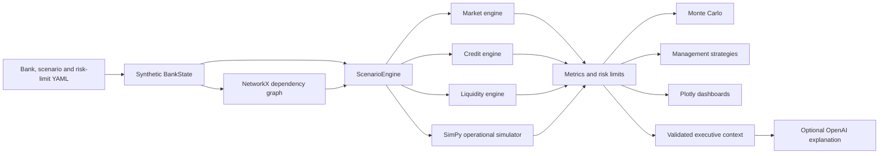
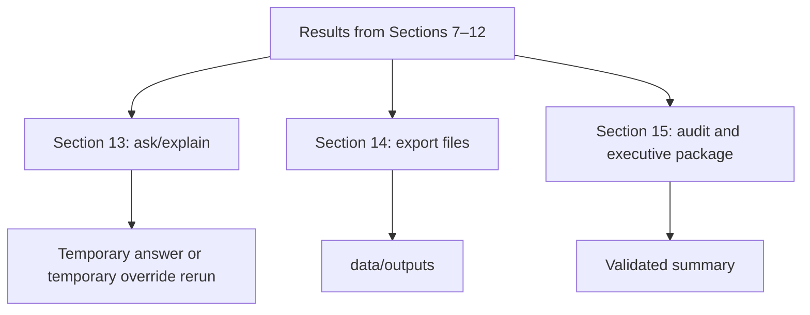

# AI Financial Digital Twin — Project Guide

An end-to-end, auditable prototype of a synthetic USD 100 billion bank. The project demonstrates how technology, operational, market, liquidity, credit, customer-behaviour, and capital risks can propagate through an interconnected banking model.

> [!IMPORTANT]
> All data and results are synthetic. This prototype is not a regulatory stress-testing model, financial advice, an approved bank risk model, or a substitute for independent model validation.

## What the project demonstrates

- A synthetic bank balance sheet, customer base, counterparties, applications, cloud deployments, payment services, and risk limits.
- YAML-driven deterministic scenarios.
- NetworkX dependency and causal-propagation paths.
- SimPy hour-by-hour payment processing, outage, failover, backlog, and recovery.
- Market, credit, liquidity, capital, and operational impact calculations.
- Monte Carlo ranges and per-metric breach probabilities.
- Management actions evaluated through full scenario reruns.
- Plotly operational, risk, cloud, and executive dashboards.
- Optional OpenAI explanations over compact, validated Python results.

## Architecture



Python is the numerical source of truth. The notebook orchestrates the existing engines; it does not contain an independent calculation model.

## Repository structure

```text
ai-financial-digital-twin/
├── configs/
│   ├── baseline_bank.yaml
│   ├── risk_limits.yaml
│   └── scenarios/
├── data/
│   └── outputs/
├── docs/
├── notebooks/
│   └── master_runner.ipynb
├── src/digital_twin/
├── tests/
├── requirements.txt
├── README.md
└── PROJECT_GUIDE.md
```

Do not upload `.venv`, `__pycache__`, `.pytest_cache`, or `.DS_Store` when copying the repository to Google Drive or GitHub.

## Core modules

| Module | Responsibility |
|---|---|
| `data_generator.py` | Creates the reproducible synthetic bank datasets. |
| `bank_state.py` | Stores bank data and scenario result objects. |
| `config.py` | Loads baseline, risk-limit, and scenario YAML files. |
| `dependency_graph.py` | Builds the NetworkX graph, blast radius, and propagation paths. |
| `scenario_engine.py` | Coordinates each complete scenario run. |
| `market_engine.py` | Calculates FX revaluation and volatility loss. |
| `credit_engine.py` | Calculates expected-loss changes and counterparty-default loss. |
| `liquidity_engine.py` | Calculates deposit outflows, cash, HQLA, funding, and prototype LCR. |
| `operational_simulator.py` | Simulates payment arrivals, processing capacity, backlog, failover, and recovery. |
| `metrics.py` | Creates KPIs, evaluates risk limits, and classifies management severity. |
| `monte_carlo.py` | Samples uncertain combined-stress inputs and reports distributions. |
| `action_engine.py` | Reruns scenarios with single and combined management actions. |
| `visualizations.py` | Produces Plotly graphs and dashboards. |
| `ai_explainer.py` | Builds compact validated LLM payloads and optional explanations. |

## Scenario library

Scenario files are stored in `configs/scenarios`.

| Scenario ID | Purpose |
|---|---|
| `usd_fall` | Revalues the bank's unhedged USD exposure. |
| `deposit_run` | Applies segment-level deposit-withdrawal stress. |
| `payment_outage` | Tests a payment-processing outage. |
| `volatility_shock` | Applies a market-volatility multiplier. |
| `cloud_failure` | Older generic cloud-failure scenario used in the individual comparison. |
| `counterparty_default` | Defaults a named synthetic counterparty. |
| `cloud_region_a_8hr` | Dedicated infrastructure-only eight-hour cloud resilience scenario. |
| `combined_stress` | Flagship simultaneous market, credit, liquidity, customer, and operational stress. |

Run one scenario with:

```python
from digital_twin.data_generator import generate_virtual_bank
from digital_twin.scenario_engine import ScenarioEngine

bank = generate_virtual_bank(seed=42)
engine = ScenarioEngine(bank)
result = engine.run("combined_stress")

print(result.metrics)
print(result.risk_limit_breaches)
```

### Independent runs versus a combined scenario

This list runs scenarios separately:

```python
scenario_names = ["usd_fall", "deposit_run", "counterparty_default"]
results = [engine.run(name) for name in scenario_names]
```

It produces three independent results. It does not combine the shocks. A true combined scenario must define all shocks in one YAML file, such as `combined_stress.yaml`.

## Dependency graph

The dependency graph is built from the synthetic dependency table using `networkx.DiGraph`.

```text
Infrastructure
→ Applications
→ Business services
→ Customer segments
→ Operational and financial effects
→ Risk metrics
```

Example validated path:

```text
Cloud Region A
→ Domestic Payments
→ Corporate
→ Corporate Deposits
→ Deposit Outflows
→ Liquidity Position
→ LCR
```

For a failed node, NetworkX identifies reachable downstream nodes and groups the blast radius by node type. Edge weights are also used for modelled customer-behaviour propagation. The LLM never creates dependencies.

## Cloud Region A eight-hour scenario

Configuration: `configs/scenarios/cloud_region_a_8hr.yaml`

```text
Hour 0:     Cloud Region A fails
Hour 0–3:   Region B is unavailable
Hour 3:     Region B activates
Hour 3–8:   Region B operates at 70% capacity
Hour 8:     Region A recovers
After 8:    125% temporary capacity clears the backlog
```

The scenario specifies the infrastructure failure only. NetworkX derives affected applications, business services, customers, and risk nodes. Application deployment data determines whether each application has a Region B backup. SimPy calculates the operational timeline.

### Payment backlog

Every hour:

```text
New backlog
= previous backlog
+ new payment arrivals
− processed payments
```

Processed payments are limited by effective capacity:

```text
Normal:            USD 0.32bn/hour
Before failover:   0% of normal
Region B active:   70% of normal
Backlog recovery: 125% of normal
```

Customer impact is an aggregate estimate based on graph-exposed customers, capacity shortfall, and configured outage sensitivity. It is not an individual-customer queue.

## Flagship combined stress

The flagship scenario simultaneously applies:

- a 10% USD shock;
- a 2.0 volatility multiplier;
- Retail, SME, Corporate, and Private Banking withdrawals;
- default of synthetic counterparty `CP-006`;
- a credit PD multiplier;
- a cloud/payment impairment with its own timing and capacity assumptions.

The cloud impairment inside `combined_stress.yaml` is not the dedicated eight-hour cloud scenario. Each has its own YAML configuration.

## Main calculations

### Market loss

```text
Market loss = FX revaluation loss + volatility loss
```

FX revaluation is applied to synthetic exposure after hedging. Volatility loss uses the configured multiplier and sensitivity.

### Credit loss

```text
Expected credit loss = EAD × PD × LGD
```

The credit engine also calculates named-counterparty default loss using synthetic exposure, collateral, and LGD.

### Deposit outflow and liquidity

```text
Segment outflow
= deposits
× scenario withdrawal rate
× withdrawal sensitivity
```

An operational outage can add graph-derived behavioural withdrawal pressure. Deposit outflow consumes liquidity but is not itself treated as accounting loss.

### Prototype LCR

```text
Prototype LCR
= eligible HQLA
÷ stressed 30-day net cash outflows
```

Eligible HQLA contains non-negative eligible cash plus securities after the configured haircut. This is a simplified prototype formula, not a regulatory LCR implementation.

### Operational loss

```text
Operational loss
= outage-duration cost
+ payment-backlog cost
+ customer-impact cost
```

### Total estimated loss

```text
Total estimated loss
= market loss
+ credit loss
+ operational loss
+ funding cost
+ realised asset-sale loss
```

Deposit outflow, cash consumption, and HQLA consumption are reported separately and are not added directly to P&L loss.

### Capital

```text
Stressed CET1 capital = baseline CET1 − total estimated loss
CET1 ratio = stressed CET1 capital ÷ prototype RWA
```

## Risk limits and severity

Configured limits are loaded from `configs/risk_limits.yaml`.

Every configured metric receives one mutually exclusive status:

```text
Within Limit
Warning
Critical
```

The management analysis also reports a non-regulatory score:

```text
Within Limit = 0
Warning      = 1
Critical     = 2

Prototype Risk Severity Score
= sum of severity points across configured metrics
```

This score is a transparent prototype management aid, not a regulatory risk score.

## Monte Carlo simulation

The notebook runs 1,000 stochastic variations of `combined_stress` using seed 42. It samples:

- USD shock;
- volatility multiplier;
- Retail, SME, and Corporate withdrawal rates;
- operational recovery duration;
- counterparty default-loss multiplier.

It reports P5, median, P95, and separate breach probabilities for LCR, cash, CET1, payment availability, loss, and recovery time.

The current Monte Carlo is designed for combined stress. Changing only the scenario name to `cloud_region_a_8hr` would still introduce the market, withdrawal, and credit random variables defined in `monte_carlo.py`; that would not be a pure cloud-only uncertainty experiment.

## Management actions

Supported actions:

| Action | Primary risk domain |
|---|---|
| Activate Backup Region | Operational resilience |
| Prioritise Critical Payments | Operational resilience |
| Sell Liquid Securities | Liquidity management |
| Draw Liquidity Facility | Liquidity risk |
| Increase FX Hedge | Market risk |
| Contact High-Risk Corporate Depositors | Liquidity/customer behaviour |

Every action modifies explicit Python simulation parameters and triggers a complete scenario rerun.

The decision lab compares:

```text
No Action
vs
Balanced Single-Action Choice
vs
Combined Response
```

It also reports the best action separately for loss, LCR, cash, operational resilience, customer impact, and balanced resilience. It does not claim a universal best action.

Combined actions are passed together into one `ScenarioEngine.run()` call. Their improvements are never calculated by adding independent action results.

Action costs are incomplete. The prototype must not claim economic ROI unless all relevant costs and monetised benefits are modelled.

## Master notebook guide

The main entry point is `notebooks/master_runner.ipynb`.

| Section | Purpose | Analysis scope |
|---|---|---|
| 0–6 | Setup, synthetic bank, baseline, and dependency graph | Shared model foundation |
| 7 | Runs the selected scenario list independently | Multiple separate runs |
| Cloud failure propagation | Visualizes the generic `cloud_failure` result | One Section 7 result |
| Cloud Region Failure | Runs the dedicated eight-hour scenario | Independent `cloud_region_a_8hr` |
| Cloud Resilience Digital Twin | Deployment, failover, timeline, concentration, and impact | Same independent eight-hour run |
| 8 | Runs the flagship combined stress | Deterministic `combined_stress` |
| LCR validation | Reconciles numerator, denominator, and assumptions | Combined stress versus baseline |
| 9 | Runs Monte Carlo ranges and breach probabilities | Variations of combined stress |
| MC operational validation | Explains availability and recovery breaches | Combined-stress Monte Carlo |
| 10 | Tests single and simultaneous management actions | Combined stress |
| Management Response Decision Lab | Compares strategies, severity, thresholds, value, and residual risk | Combined stress |
| 11 | Creates the validated executive context and optional AI explanation | Combined-stress workflow |
| 12 | Displays the CEO/CIO dashboard | Combined stress and combined response |
| 13 | Answers interactive CEO questions | Combined stress by default |
| 14 | Exports previously calculated results | No new scenario run |
| 15 | Creates the final audit/executive package | Catalogue plus combined-stress executive context |

### Relationship between Sections 13, 14, and 15



Section 13 does not automatically update Sections 14 or 15. A temporary override inside `ask_ceo()` is explained but is not assigned to the shared `combined` result.

## OpenAI integration

OpenAI is optional. Set the key as an environment variable or a Google Colab secret:

```text
OPENAI_API_KEY
```

Optionally set:

```text
OPENAI_MODEL
```

The integration sends a compact validated executive context containing calculated metrics, breaches, propagation paths, Monte Carlo summaries, management actions, thresholds, severity transitions, and residual risks. Raw operational time series and unnecessary simulation records are excluded.

The LLM may explain supplied results. It must not:

- calculate financial impacts;
- modify severity classifications;
- invent graph dependencies;
- change scenario assumptions or thresholds;
- claim regulatory validity or economic ROI.

Without a key, the project returns a deterministic Python summary.

## Outputs

The notebook writes generated artifacts to `data/outputs`, including scenario comparisons, Monte Carlo results, propagation traces, executive summaries, and management-action comparisons.

Generated outputs are reproducible when the same code, YAML, and seed are used.

## Installation

### Local environment

```bash
python3 -m venv .venv
source .venv/bin/activate
python -m pip install --upgrade pip
python -m pip install -r requirements.txt
python -m pip install -e .
pytest -q
jupyter notebook notebooks/master_runner.ipynb
```

### Google Colab

1. Copy the repository folder to Google Drive.
2. Open `notebooks/master_runner.ipynb` in Colab.
3. Change `PROJECT_ROOT` only if your Drive path differs.
4. Store `OPENAI_API_KEY` as a Colab secret if AI narration is required.
5. Choose **Runtime → Run all**.

The notebook installs missing dependencies and writes outputs back into the repository folder.

## Testing

Run the complete suite with:

```bash
pytest -q
```

Tests cover:

- scenario loading and deterministic execution;
- market, liquidity, credit, and KPI calculations;
- dependency propagation and visualization state;
- cloud deployment, failover, no-backup applications, and timeline;
- LCR numerator and denominator reconciliation;
- Monte Carlo breach probabilities and operational-variable propagation;
- management-action attribution and simultaneous reruns;
- percentage suppression across non-positive baselines;
- risk severity, thresholds, severity distribution, and residual risk;
- payment-prioritisation recovery behavior;
- securities-sale HQLA reconciliation;
- executive-context construction and payload compaction.

At the time this guide was generated, the suite contained 36 passing tests.

## Known limitations

- All data is synthetic and deliberately compact.
- The LCR is simplified and non-regulatory.
- Market risk is sensitivity-based rather than full revaluation.
- Credit risk does not contain full migration, contagion, or wrong-way-risk modelling.
- Operational availability is based on configured regional capacity fractions.
- Customer impact is an aggregate approximation, not individual event tracking.
- Monte Carlo distributions are illustrative and not empirically calibrated.
- Management action costs are incomplete, so economic ROI cannot be claimed.
- RWA generally remains unchanged during stress.
- The model has not been independently validated, calibrated, or back-tested against a real bank.

Production use would require governed source data, lineage, access control, scenario approval, calibration, independent validation, monitoring, back-testing, change control, and regulatory interpretation.

## Additional documentation

- [README](README.md)
- [Architecture](docs/architecture.md)
- [Methodology](docs/methodology.md)
- [Assumptions](docs/assumptions.md)

