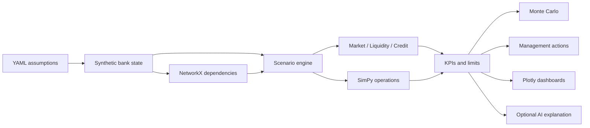

# AI Financial Digital Twin

An end-to-end, auditable prototype of a synthetic $100bn virtual bank. It demonstrates how market, liquidity, credit, payment, infrastructure, vendor, customer, and capital shocks can propagate through an interconnected operating model.

> **Prototype disclaimer:** Synthetic data only. This is not regulatory stress testing, financial advice, an approved bank risk model, or a substitute for bank-specific model validation.

## Architecture



Core code is in `src/digital_twin`; the Colab notebook only orchestrates it. Scenario and bank assumptions live in YAML, and each result includes shocks, calculation details, propagation paths, breaches, and an audit log.

The digital-twin layer emits explicit edge-level propagation events and ranks causal paths. The decision-intelligence layer reports per-metric Monte Carlo breach probabilities, liquidity-versus-P&L attribution, action-level before/after improvements, residual risk, and a compact validated executive context for the optional LLM.

Interactive Plotly dependency maps provide a complete layered baseline architecture plus full and focused scenario views. Hover details expose node type, criticality, operational/impact state, centrality, dependencies, downstream reach, and validated scenario values.

## Repository structure

```text
configs/                 baseline, limits, and seven scenarios
data/                    synthetic/market placeholders and generated outputs
docs/                    architecture, methodology, assumptions
notebooks/master_runner.ipynb
src/digital_twin/        deterministic engines and optional AI narrator
tests/                   deterministic unit and integration tests
```

## Local installation and execution

```bash
python -m venv .venv
source .venv/bin/activate
python -m pip install -r requirements.txt
python -m pip install -e .
pytest -q
jupyter notebook notebooks/master_runner.ipynb
```

Quick Python usage:

```python
from digital_twin.data_generator import generate_virtual_bank
from digital_twin.scenario_engine import ScenarioEngine

bank = generate_virtual_bank(seed=42)
result = ScenarioEngine(bank).run("combined_stress")
print(result.metrics)
```

## Google Colab

Copy the whole repository folder into Google Drive as `MyDrive/ai-financial-digital-twin`. Open `notebooks/master_runner.ipynb` in Colab, change only the clearly marked `PROJECT_ROOT` if needed, and choose **Runtime → Run all**. The notebook mounts Drive, adds `PROJECT_ROOT/src` to `sys.path`, installs `PROJECT_ROOT/requirements.txt`, and writes exports to `data/outputs`—it does not clone GitHub.

## Scenario library

The included scenarios are USD -10%, deposit run, payment outage, volatility doubling, cloud failure, major synthetic counterparty default, and the flagship combined stress. The management engine can activate backup capacity, prioritise critical payments, sell liquid securities, draw a facility, increase FX hedging, or contact high-risk corporate depositors. Each action changes explicit numerical parameters and is re-simulated.

`cloud_region_a_8hr.yaml` provides a dedicated infrastructure-only digital-twin scenario: Region A fails at hour 0, Region B activates at hour 3 with 70% capacity, Region A returns at hour 8, and 125% configurable recovery capacity clears the backlog. Its application, service, customer, and financial blast radius is derived from NetworkX rather than listed in the scenario.

The **Cloud Resilience Digital Twin** notebook section shows primary/backup deployment, hour-0 failure, hour-3 failover, business propagation, the SimPy outage timeline, region concentration, no-backup exposures, and a technology/operations/customer/financial executive summary.

## Methodology and AI role

All numbers are computed in Python: hedged FX P&L, simplified deposit outflows and LCR, PD×LGD×EAD expected loss, EAD×LGD default loss, SimPy payment recovery, NetworkX propagation, and NumPy Monte Carlo uncertainty. The OpenAI integration receives only validated result JSON and writes narrative; it does not calculate ratios, invent data, or override limits. Without `OPENAI_API_KEY`, a deterministic summary is returned.

See [methodology](docs/methodology.md), [assumptions](docs/assumptions.md), and [architecture](docs/architecture.md).

## Limitations and governance

This compact cohort model excludes contractual cash-flow ladders, regulatory LCR classifications, market full revaluation, migration matrices, wrong-way risk, contagion calibration, intraday ledger detail, and empirical validation. Before any production use, a bank would need governed source data, data lineage, independent model validation, scenario approval, access controls, monitoring, calibration, back-testing, change control, and regulatory interpretation.
